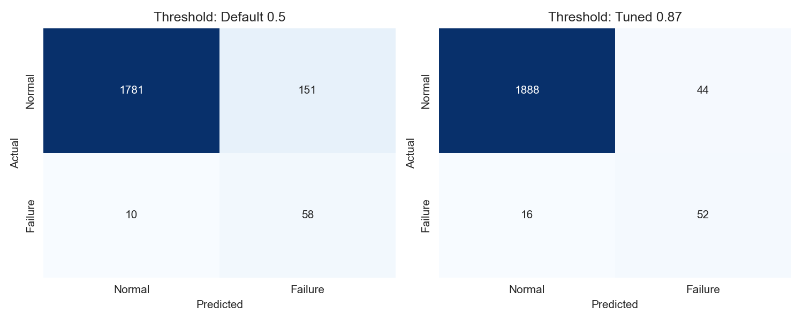
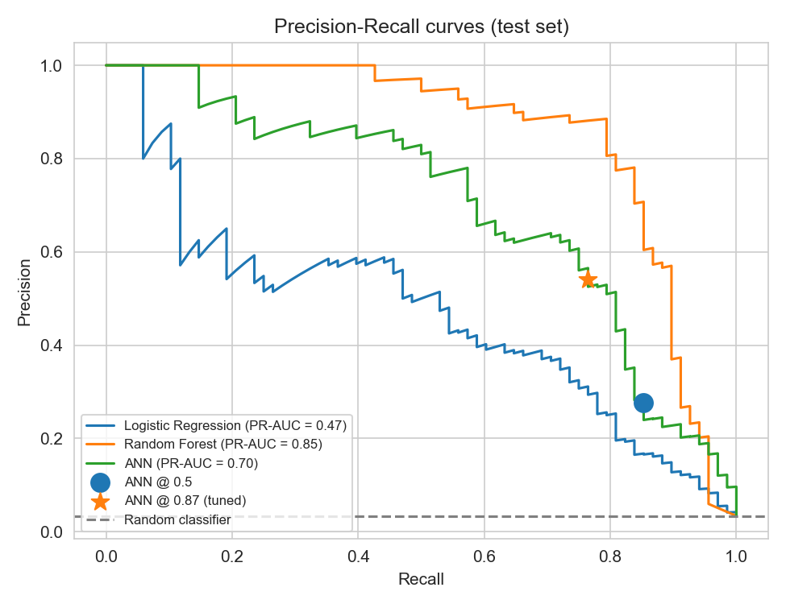
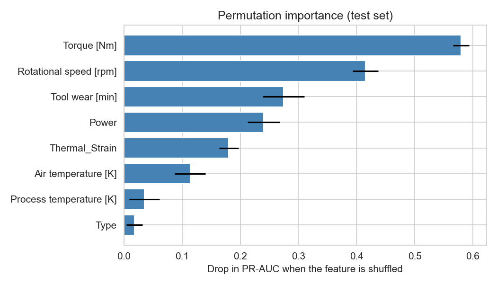

Industrial Machine Failure Prediction

Predictive maintenance with a PyTorch neural network: predict whether an industrial machine will fail from its sensor readings, and compare the model against classical baselines.

Problem Statement

Unplanned machine failures cause downtime and repair costs. The goal is to predict failures in advance from sensor data so maintenance can be planned before a breakdown.

The main challenge is class imbalance: only about 3.4% of the records are failures, so a model that always predicts "no failure" is already ~96% accurate while being useless. This project therefore focuses on recall, PR-AUC and the cost of errors, not on accuracy.

Dataset
AI4I 2020 Predictive Maintenance Dataset (ai4i2020.csv), 10,000 records, 339 failures (~3.4%)
Features: product Type (L / M / H), air temperature, process temperature, rotational speed, torque, tool wear
Target: Machine failure (0 = normal, 1 = failure)
The failure-mode columns (TWF, HDF, PWF, OSF, RNF) and ID columns are dropped. The failure modes are derived from the target, so keeping them would cause data leakage.
Approach
EDA: class imbalance, failure rate by product type, feature distributions, correlations
Feature engineering: Thermal_Strain (process - air temperature) and Power (torque x rpm, a load indicator)
Split: stratified 60 / 20 / 20 train / validation / test
Preprocessing: ColumnTransformer (StandardScaler + OneHotEncoder), fitted on the training set only
Baselines: Logistic Regression, Random Forest, XGBoost (optional)
Neural network (PyTorch): 10 -> 64 -> 32 -> 1, ReLU, Dropout(0.2), BCEWithLogitsLoss with pos_weight calculated from the training data, Adam, early stopping on validation loss
Threshold tuning: decision threshold chosen on the validation set by maximizing F2 (recall-weighted)
Extra analysis: ablation study (with/without engineered features), 5-fold stratified cross-validation, permutation feature importance, business cost analysis
Deployment-ready: model, preprocessor and threshold saved to artifacts/, and a predict_failure() function for single readings
Results

Initial version (before the improvements, default threshold 0.5, ANN only, test set): recall 0.90 and precision 0.25 for the failure class (55 of 61 failures caught, 162 false alarms).

TODO: run machine-failure-prediction.ipynb and paste the tables printed by the last cell here (model comparison, ANN at two thresholds, ablation study, cross-validation, business cost). Also add the plots from the images/ folder, for example:

markdown

The business cost table uses assumed costs (missed failure = 50,000, false alarm = 2,000). Replace them with real values if available.

How to Run
bash
git clone https://github.com/sanjosh30/Industrial-Machine-Failure-Prediction.git
cd Industrial-Machine-Failure-Prediction
pip install -r requirements.txt
jupyter notebook machine-failure-prediction.ipynb

Run all cells from top to bottom. ai4i2020.csv must be in the same folder as the notebook. Plots are saved to images/ and the trained model to artifacts/.

Predict for a single machine after training:

python
predict_failure(air_temp=300.0, process_temp=310.5, rpm=1400, torque=60.0, tool_wear=220, machine_type="L")
Tech Stack

Python, pandas, NumPy, scikit-learn, PyTorch, Matplotlib, Seaborn

Limitations and Future Work
The dataset is synthetic and small (339 failures), so results are an estimate of performance on real machines, not a guarantee.
The tuned threshold comes from a validation set with few failures, so it is approximate.

 
